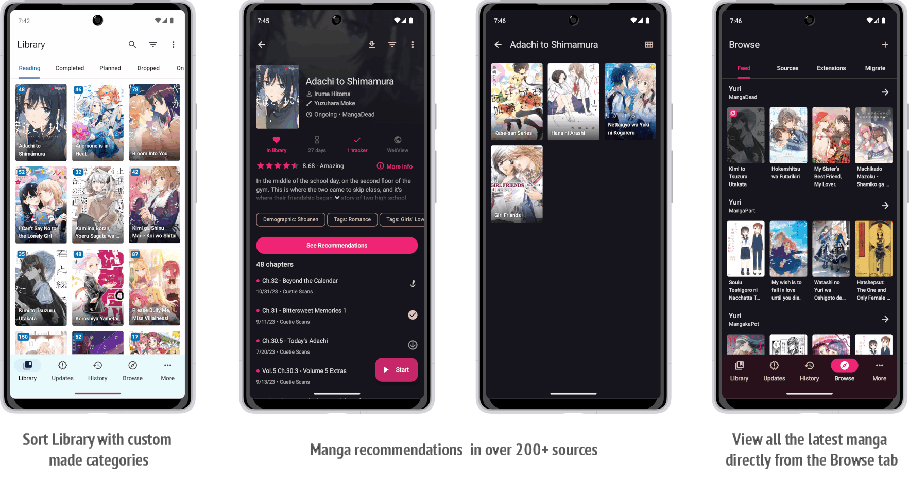

| Preview Builds | Release Builds |
|-------|----------|
|  |  |

# Fabsemanga
Fabsemanga is a free and open source manga reader for Android 6.0 and above. Based on the og manga lord and its fork, namely [TachiyomiSY](https://github.com/jobobby04/TachiyomiSY).

## Features

Features of Tachiyomi(original) include:
* Online reading from a variety of sources
* Local reading of downloaded content
* A configurable reader with multiple viewers, reading directions and other settings.
* Tracker support: [MyAnimeList](https://myanimelist.net/), [AniList](https://anilist.co/) and [Kitsu](https://kitsu.io/) support
* Categories to organize your library
* Light and dark themes
* Schedule updating your library for new chapters
* Create backups locally to read offline or to your desired cloud service

Features of Fabsemanga include:
* Latest tab, store up to 5 sources where you can easily view the latest manga by viewing the tab
* Automatic webtoon detection, allowing the reader to switch to webtoon mode automatically when viewing one
* Manga recommendations, uses MAL and Anilist, as well as Neko Similar Manga for Mangadex manga(Thanks to Az, She11Shocked, Carlos, and Goldbattle)
* Lewd filter, hide the lewd manga in your library when you want to
* Tracking filter, filter your tracked manga so you can see them or see non-tracked manga, made by She11Shocked
* Search tracking status in library, made by She11Shocked
* Custom categories for sources, liked the pinned sources, but you can make your own versions and put any sources in them
* Manga info edit
* Manga Cover view + share and save
* Dynamic Categories, view the library in multiple ways
* Smart background for reading modes like LTR or Vertical, changes the background based on the page color
* Force disable webtoon zoom
* Continue reading button in library
* Quick clean titles
* Source migration, migrate all your manga from one source to another
* Saving searches
* Autoscroll
* Page preload customization
* Customize image cache size
* Automatic CAPTCHA solving
* Advanced source settings page, searching, enable/disable all
* Click tag for local search, long click tag for global search
* Merge multiple of the same manga from different sources
* Drag and drop library sorting
* Library search engine, includes exclude, quotes as absolute, and a bunch of other ways to search
* Enhanced views for internal and integrated sources
* Enhanced usability for internal and delegated sources

Additional features for some extensions, features include custom description, opening in app and a bunch of other things based on the source:
* Mangadex

## Download
Get the app from our [releases page](https://codeberg.org/fabseman/fabsemanga/releases).

## Issues, Feature Requests and Contributing

Please make sure to read the full guidelines. Your issue may be closed without warning if you do not.

Issues

1. **Before reporting a new issue, take a look at the [changelog](https://codeberg.org/fabseman/fabsemanga/releases) and the already opened [issues](https://codeberg.org/fabseman/fabsemanga/issues).**

Bugs

* Include version (More → About → Version)
* If not latest, try updating, it may have already been solved
* Preview version is equal to the number of commits as seen on the main page
* Include steps to reproduce (if not obvious from description)
* Include screenshot (if needed)
* If it could be device-dependent, try reproducing on another device (if possible)
* Don't group unrelated requests into one issue

Feature Requests

* Write a detailed issue, explaining what it should do or how. Avoid writing just "like X app does"
* Include screenshot (if needed)

Source requests are not accepted.

Contributing

See [CONTRIBUTING.md](./CONTRIBUTING.md).

Code of Conduct

See [CODE_OF_CONDUCT.md](./CODE_OF_CONDUCT.md).

### Disclaimer

The developer of this application does not have any affiliation with the content providers available.
